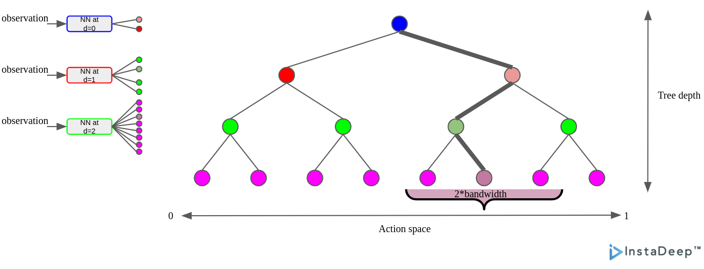
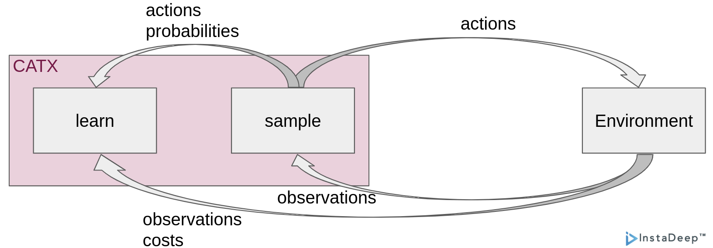

# CATX




CATX implements Contextual Bandits with Continuous Actions in JAX.
It allows implementing custom neural network architecture per tree layer.


## Hands on CATX

CATX follows the approach proposed in the paper [Efficient Contextual Bandits with Continuous Actions](https://arxiv.org/pdf/2006.06040.pdf).

To understand how CATX works, checkout out the [documentations](https://catx.readthedocs.io/en/latest/).

## CATX training loop example:



```python
# CATX imports
import haiku as hk
import jax
import optax
from catx.catx import CATX
from catx.network_builder import NetworkBuilder
from examples.openml_environment import OpenMLEnvironment

# Network builder
class MLPBuilder(NetworkBuilder):
    def create_network(self, depth: int) -> hk.Module:
        return hk.nets.MLP([10, 10] + [2 ** (depth + 1)], name=f"mlp_depth_{depth}")


def main() -> None:
    # JAX pseudo-random number generator
    rng_key = jax.random.PRNGKey(42)
    catx_key, env_key = jax.random.split(rng_key, num=2)

    # Instantiate the CATX
    builder = MLPBuilder()
    optimizer = optax.adam(learning_rate=0.01)
    catx = CATX(
        rng_key=catx_key,
        network_builder=builder,
        optimizer=optimizer,
        discretization_parameter=8,
        bandwidth=1 / 8,
    )

    # Instantiate the environment (black_friday dataset id from https://www.openml.org/)
    environment = OpenMLEnvironment(dataset_id=41540, batch_size=10)

    # Training loop
    for _ in range(1000):
        env_key, cost_key = jax.random.split(env_key)
        obs = environment.get_new_observations(env_key)
        if obs is None:
            break
        actions, probabilities = catx.sample(obs=obs, epsilon=0.05)
        costs = environment.get_costs(key=cost_key, obs=obs, actions=actions)
        catx.learn(obs, actions, probabilities, costs)


if __name__ == "__main__":
    main()
```


## Installation

### step 1: CATX installation
The simplest way to install CATX is through PyPI:
`pip install catx`

We recommend using either Docker, Singularity, or conda to use the repository.

### step 2 \[Optional\]: JAX GPU installation
CATX installation in step 1 uses JAX on CPU.

To unleash the full speed of CATX and have access to a GPU, a GPU version of JAX must be installed.

JAX installation is different depending on your CUDA version. Follow these [instructions](https://github.com/google/jax#installation)
to install JAX with the relevant accelerator support.

TL;DR:

run `pip install --upgrade pip` then run one of the following depending on your machine:

- No GPU (not needed as JAX cpu was installed in step 1):

    `pip install --upgrade "jax[cpu]"`

- GPU with CUDA 11 and cuDNN 8.2 or newer:

    `pip install --upgrade "jax[cuda]" -f https://storage.googleapis.com/jax-releases/jax_cuda_releases.html`


- GPU with Cuda >= 11.1 and cudnn >= 8.0.5:

    `pip install "jax[cuda11_cudnn805]" -f https://storage.googleapis.com/jax-releases/jax_cuda_releases.html`


## Installation development and contributions:

- Clone your fork of this repo:

    `git clone git@gitlab.com:instadeep/catx.git`
    or
    `git clone git@github.com:instadeepai/catx.git`

- Go to directory:

  `cd catx`

- Add upstream repo

    `git remote add upstream https://gitlab.com/instadeep/catx.git`
    or
    `https://github.com/instadeepai/catx.git`

- Create your venv or conda environment and install dependencies:

    conda:
    ```
    conda env create -f environment.yaml
    conda activate catx
    ```

    venv:
    ```
    python3 -m venv
    pip install -e .[tool,test]
    ```

- \[Optional\] follow step 2 above for JAX to use GPU.


## Citing CATX

To cite this repository:

```
@software{catx2022github,
  author = {Wissam Bejjani and Cyprien Courtot},
  title = {{CATX}: contextual bandits library for {C}ontinuous {A}ction {T}rees with {S}moothing in {JAX}},
  url = {https://github.com/instadeepai/catx/},
  version = {0.1.2},
  year = {2022},
}
```

In this bibtex entry, the version number is intended to be from
[`catx/VERSION`](https://github.com/instadeepai/catx/blob/main/catx/VERSION),
and the year corresponds to the project's open-source release.
