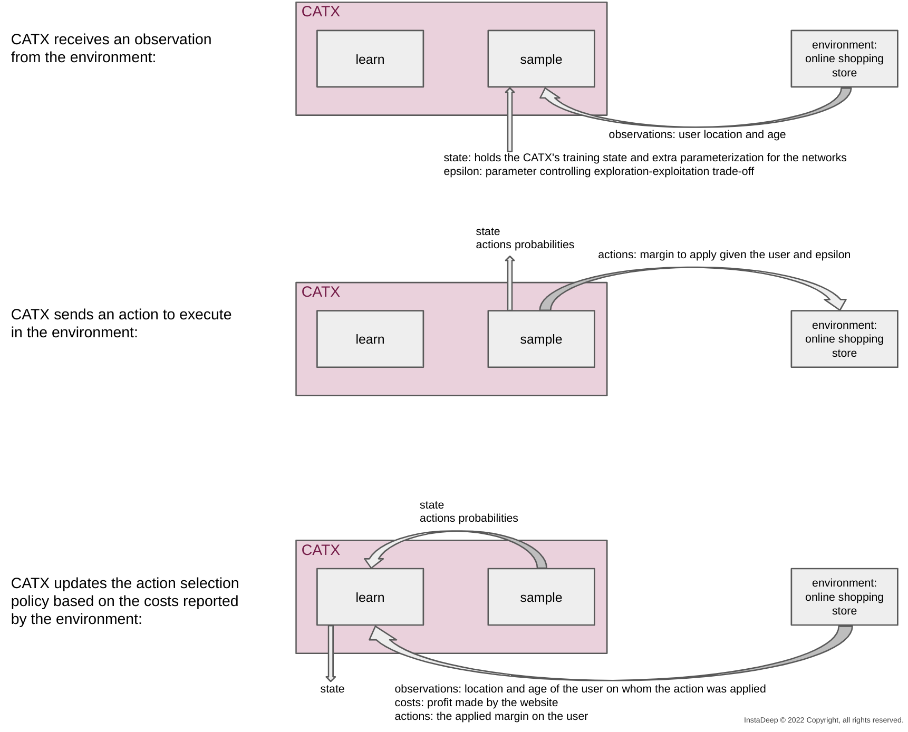

# From bandits to contextual Bandits with continuous actions

## What are bandits?
The bandits' problem consists of finding the action to execute among several actions
that entail the lowest cost (or highest reward).

The classic bandits' example goes as follows:

In a casino far far away, there exist multiple slot machines (also known as multi-armed bandit).
Each machine represents an action. The illustrated example shows 4 machines, i.e., 4 actions.
Some machines have higher winning probabilities.
For example, the blue machine could have a win probability of 2% while the green machine 2.5%, the yellow 1.5%, and the red 3%.
It is most advantageous to always play the red machine but these probabilities are not known to the player.
The goal is to find the best machine to play while minimizing the amount of time or money wasted on suboptimal machines.
Most approaches to this problem start by randomly trying machines and keeping track of each machine's win rate,
then gradually converging to the machine which appears to have the highest winning probability.

---
A/B testing is one of the simplest approaches to tackle the bandits' problem:

* step 1: try each machine a fixed number of times

* step 2: always play the machine with the highest win rate as unravelled in step 1

Note: A/B testing focuses on simplicity
at the expense of not minimizing the amount of time or money wasted on suboptimal actions.
---

The same bandits' problem can be found under different domains.
For example, in an online shopping store, the pricing algorithm has to select the profit margin to add on certain product
from 4 available profit margin options, say 2%, 4%, 6%, and 8%.
A too high of a margin will drive customers away and a low margin might be missing a profit opportunity.

## What are contextual bandits?
Contextual bandits are similar the previous bandits problem with a small difference.
The cost (or reward) associated to an action is also conditioned on the current context of the environment.
The contextexual information is also available to the dacision maker.

Following on our previous slot machine example, we could think of the winning probabilities of each machine as
dependent on contextual information such as the room temperature and humidity.
For example, the blue machine electronics could be sensitive to the room temperature and humidity.
When it is hot and humid its winning probability is 4% while when it is cold and dry it's winning
probability goes down to 2%. When it is hot and dry, or cold and humid, it's winning probability becomes 3%.
Different machine are affected differently by the context.

In the online shopping example, the contextual information could be the location and age
of the customer.

Solving a contextual bandits' problem often involves learning conditional probabilities over the actions
conditioned by the context.

## What are contextual bandits with continuous actions?
From an application perspective, contextual bandits with continuous actions
are the more general case of contextual bandits where the actions
are defined over a continuous space.

Also following the slot machine example, now instead of having 4 machines, i.e., actions, to choose from,
there is only one slot machine with an action selection knob that can be rotated anywhere between 0 and 180 degrees.
The winning probability over the continuous action space is also conditioned by the temperature and humidity context.

In the online shopping store example, the action range is now defined over a continuous margin value between 2% and 8%.
The continuous action space gives more freedom to the pricing algorithm to finetune the margin
to **minimize the regret** of missing profit opportunities or driving customers away.

## CATX and the online shopping example:
Below is a visual example of using CATX to learn the best margin to apply in the online shopping example.
CATX plays the role of the pricing algorithm setting the margin given the user context.

